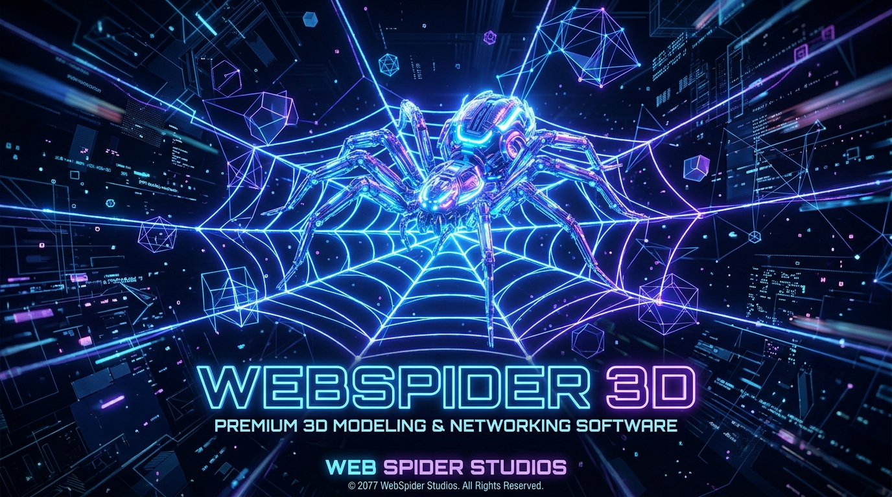

  

  # WebSpider Studios Asset Repository

  **Official Central Release Assets, Binary Installers & Brand Media**

  
  
  

---

## 🚀 Overview

Welcome to the official **WebSpider Studios Assets Repository**. This repository serves as the centralized CDN and distribution hub for installer setups, release executables (`.exe`), mobile packages (`.apk`), archive bundles (`.zip`/`.tar.gz`), and official brand artwork for the **WebSpider Studios** software suite.

---

## 📦 Released Binary Installers & Packages

| Product | Version | File Name | Platform | Direct Download |
| :--- | :---: | :--- | :---: | :---: |
| **WebSpider 3D** | `v3.1.49` | `WebSpider3D_Setup_3.1.49.exe` | Windows 10/11 (x64) | [<kbd>⬇️ Download Setup (.exe)</kbd>](https://github.com/VR-WebSpider/webspider-assets/raw/main/WebSpider3D_Setup_3.1.49.exe) |
| **WebSpider AI IDE** | `v1.0.0` | `WebSpiderAIIDE-Setup-1.0.0-x64.exe` | Windows 10/11 (x64) | [<kbd>⬇️ Download Setup (.exe)</kbd>](https://github.com/VR-WebSpider/webspider-assets/releases/download/v1.0.0/WebSpiderAIIDE-Setup-1.0.0-x64.exe) |
| **WebSpider AI IDE (Portable)** | `v1.0.0` | `WebSpider-IDE-Windows.zip` | Windows 10/11 (x64) | [<kbd>⬇️ Download Portable (.zip)</kbd>](https://github.com/VR-WebSpider/webspider-assets/releases/download/v1.0.0/WebSpider-IDE-Windows.zip) |
| **WebSpider Launcher** | `v1.0.0` | `WebSpiderLauncher_Setup_1.0.0.exe` | Windows 10/11 (x64) | [<kbd>⬇️ Download Launcher (.exe)</kbd>](https://github.com/VR-WebSpider/webspider-assets/releases/download/v1.0.0/WebSpiderLauncher_Setup_1.0.0.exe) |
| **WebSpider Smart Downloader** | `v1.0.0` | `WebSpider_Smart_Downloader_v1.0.apk` | Android 8.0+ | [<kbd>⬇️ Download Android (.apk)</kbd>](https://github.com/VR-WebSpider/webspider-assets/raw/main/WebSpider_Smart_Downloader_v1.0.apk) |

---

## 🎨 Official Product Showcase & Branding

### WebSpider 3D Suite (Built on Blender 5.0)

  

---

## 🎨 Brand Assets Directory (`/branding`)

Official logos, vector icons, and artwork are stored in the [`branding/`](branding/) folder:

- 🖼️ **Official Logo**: [`branding/webspider_logo.png`](branding/webspider_logo.png)
- 🖥️ **3D Splash Artwork**: [`branding/webspider3d_splash.png`](branding/webspider3d_splash.png)
- ⚡ **SVG App Icon**: [`branding/webspider_icon.svg`](branding/webspider_icon.svg)

---

## ⚖️ Licensing & Trademarks

- **Software Source Code**: Source repositories (such as [WebSpider 3D](https://github.com/VR-WebSpider/WebSpider-3D)) are published under the **GNU General Public License v3.0 or later (GPL-3.0-or-later)**.
- **Brand Assets & Trademarks**: The WebSpider Studios name, WebSpider 3D name, logos, and product artwork are trademarks of **WebSpider Studios** governed under `LicenseRef-WebSpider-Brand`.

---

## 🌐 WebSpider Studios Ecosystem Links

- 🌐 **Official Website**: [webspiderstudios.com](https://github.com/VR-WebSpider/WebSpider-Studios)
- 🎨 **WebSpider 3D Repository**: [github.com/VR-WebSpider/WebSpider-3D](https://github.com/VR-WebSpider/WebSpider-3D)
- 💼 **WebSpider Studios GitHub**: [github.com/VR-WebSpider](https://github.com/VR-WebSpider)

  Copyright © 2026 WebSpider Studios. All rights reserved.

