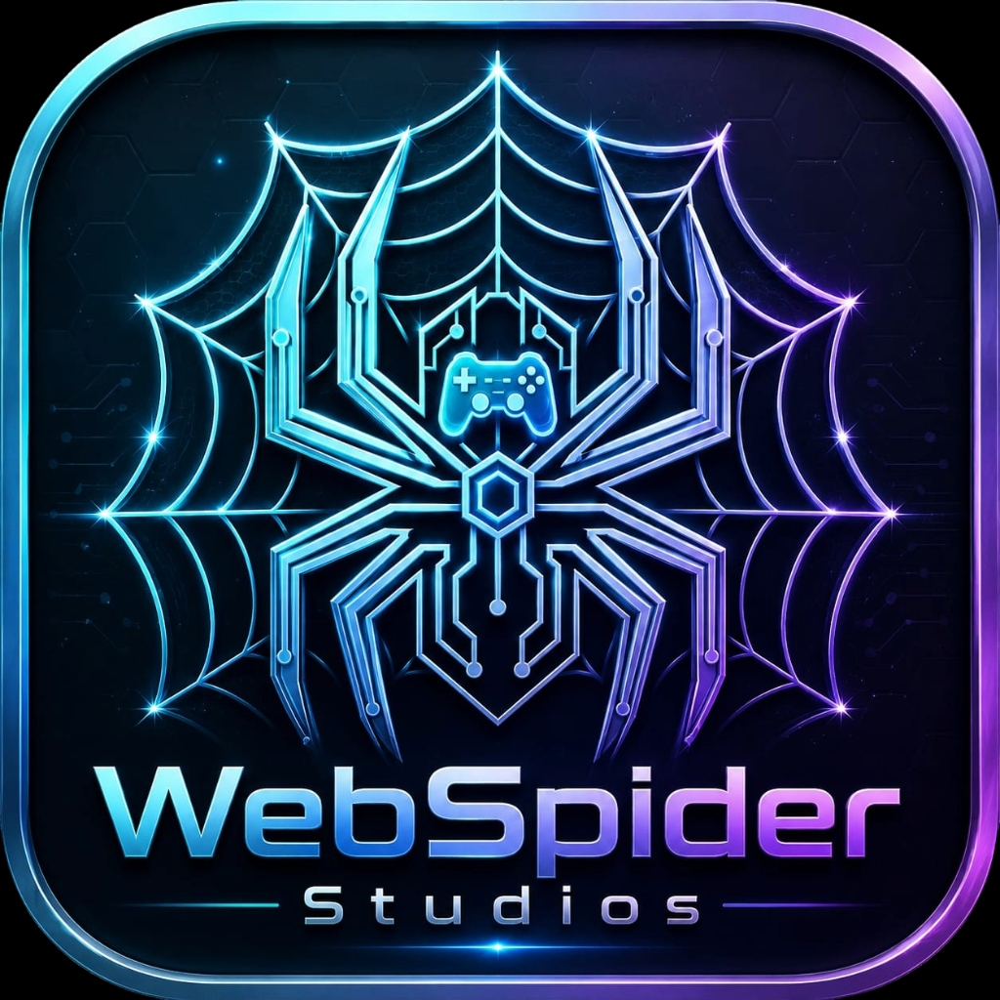

  

  # WebSpider Studios Official Asset Hub

  **Centralized Distribution Hub for WebSpider Studios Executables, Installers, & Official Brand Media**

  
  
  

---

## 🔒 Proprietary Asset Rights & Notice

> [!IMPORTANT]
> All binary software builds, installer setups (`.exe`), application packages (`.apk`, `.dmg`, `.zip`), logos, icons, wordmarks, and media assets in this repository are **proprietary assets of WebSpider Studios** and are **NOT open source**.
>
> Copyright © 2026 WebSpider Studios. All Rights Reserved. Unauthorized copying, redistribution, reverse-engineering, or commercial use of these brand assets or binary builds without prior written authorization from WebSpider Studios is strictly prohibited.

---

## 📦 WebSpider Studios Official Releases & Installers

| Product | Category | Version | Platform | Official Download |
| :--- | :--- | :---: | :---: | :---: |
| 💻 **WebSpider AI IDE** | AI Code Editor | `v1.0.0` | Windows | [<kbd>⬇️ Setup (.exe)</kbd>](https://github.com/VR-WebSpider/webspider-assets/releases/download/v1.0.0/WebSpiderAIIDE-Setup-1.0.0-x64.exe) \| [<kbd>📦 Portable (.zip)</kbd>](https://github.com/VR-WebSpider/webspider-assets/releases/download/v1.0.0/WebSpider-IDE-Windows.zip) |
| 🚀 **WebSpider Launcher** | PC Game Launcher | `v1.0.0` | Windows | [<kbd>⬇️ Setup (.exe)</kbd>](https://github.com/VR-WebSpider/webspider-assets/releases/download/v1.0.0/WebSpiderLauncher_Setup_1.0.0.exe) |
| 📱 **WebSpider Smart Downloader** | Media Downloader | `v1.0.0` | Android | [<kbd>⬇️ Download (.apk)</kbd>](https://github.com/VR-WebSpider/webspider-assets/raw/main/WebSpider_Smart_Downloader_v1.0.apk) |
| 🎨 **WebSpider 3D** | 3D Creation Suite | `v3.1.49` | Windows | [<kbd>⬇️ Setup (.exe)</kbd>](https://github.com/VR-WebSpider/webspider-assets/raw/main/WebSpider3D_Setup_3.1.49.exe) |
| 🌐 **WebSpider Browser** | Smart Web Browser | `v1.0.0` | Windows / Web | [<kbd>🌐 Launch Browser</kbd>](https://github.com/VR-WebSpider/WebSpider-Studios) |
| 🎮 **WebSpider GDD Tool** | Game Design Builder | `v1.0.0` | Web / App | [<kbd>🎮 Launch GDD Tool</kbd>](https://github.com/VR-WebSpider/WebSpider-Studios) |

---

## 🎨 Official WebSpider Studios Brand Logos (`/branding`)

The [`branding/`](branding/) directory contains official original WebSpider Studios logos and brand artwork:

| Preview | Asset Name | File Path |
| :---: | :--- | :--- |
|  | **White Studio Logo** | [`branding/studio_logo_white.png`](branding/studio_logo_white.png) |
|  | **Black Studio Logo** | [`branding/studio_logo_black.png`](branding/studio_logo_black.png) |
|  | **Main Studio Logo** | [`branding/logo.png`](branding/logo.png) |
|  | **Arachnid Green Logo** | [`branding/logo-green.png`](branding/logo-green.png) |
|  | **Cyber Blue Logo** | [`branding/logo-blue.png`](branding/logo-blue.png) |

---

## 🌐 Official Links & Resources

- 🌐 **WebSpider Studios Website**: [webspiderstudios.com](https://github.com/VR-WebSpider/WebSpider-Studios)
- 🏢 **GitHub Organization**: [github.com/VR-WebSpider](https://github.com/VR-WebSpider)

---

  Copyright © 2026 WebSpider Studios. All rights reserved.

