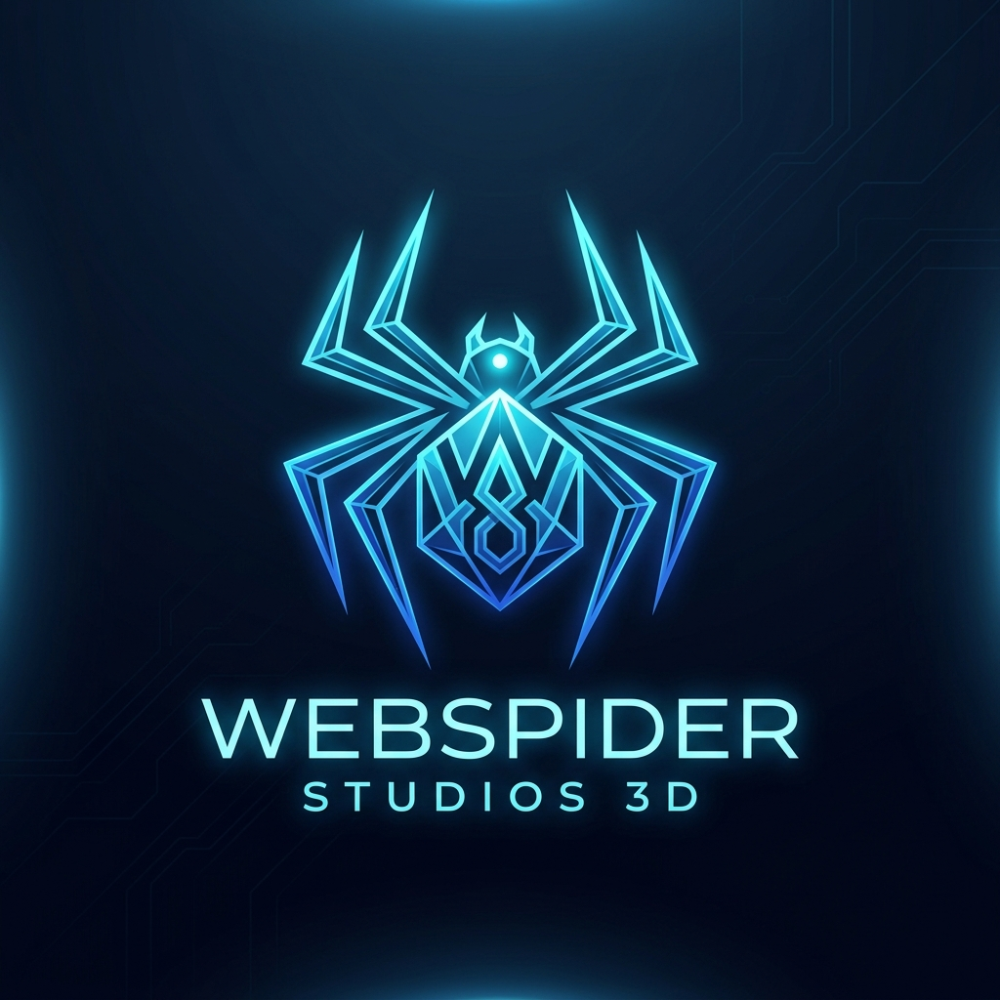

  

  # WebSpider Studios Asset Repository

  **Official Central Distribution Hub for WebSpider Studios Products, Binary Installers & Brand Media**

  
  
  

---

## 🏛️ About WebSpider Studios

**WebSpider Studios** is an innovative software development studio building next-generation AI-powered applications, creative suites, gaming infrastructure, and web tools. 

This repository serves as the official centralized storage hub for **WebSpider Studios** brand assets, installer setup binaries, application release builds, and distribution media.

---

## 📦 WebSpider Studios Product Suite & Download Hub

| Product Name | Category | Version | Platform | Quick Download |
| :--- | :--- | :---: | :---: | :---: |
| 💻 **WebSpider AI IDE** | AI Code Editor | `v1.0.0` | Windows | [<kbd>⬇️ Setup (.exe)</kbd>](https://github.com/VR-WebSpider/webspider-assets/releases/download/v1.0.0/WebSpiderAIIDE-Setup-1.0.0-x64.exe) \| [<kbd>📦 Portable (.zip)</kbd>](https://github.com/VR-WebSpider/webspider-assets/releases/download/v1.0.0/WebSpider-IDE-Windows.zip) |
| 🚀 **WebSpider Launcher** | PC Game Launcher | `v1.0.0` | Windows | [<kbd>⬇️ Setup (.exe)</kbd>](https://github.com/VR-WebSpider/webspider-assets/releases/download/v1.0.0/WebSpiderLauncher_Setup_1.0.0.exe) |
| 📱 **WebSpider Smart Downloader** | Media Downloader | `v1.0.0` | Android | [<kbd>⬇️ Download (.apk)</kbd>](https://github.com/VR-WebSpider/webspider-assets/raw/main/WebSpider_Smart_Downloader_v1.0.apk) |
| 🎨 **WebSpider 3D** | 3D Creation Suite | `v3.1.49` | Windows | [<kbd>⬇️ Setup (.exe)</kbd>](https://github.com/VR-WebSpider/webspider-assets/raw/main/WebSpider3D_Setup_3.1.49.exe) |
| 🌐 **WebSpider Browser** | Smart Web Browser | `v1.0.0` | Windows / Web | [<kbd>🌐 Explore Browser</kbd>](https://github.com/VR-WebSpider/WebSpider-Studios) |
| 🎮 **WebSpider GDD Tool** | Game Design Builder | `v1.0.0` | Web / App | [<kbd>🎮 Open GDD Tool</kbd>](https://github.com/VR-WebSpider/WebSpider-Studios) |

---

## 🎨 WebSpider Studios Brand Assets (`/branding`)

Official logos, vector wordmarks, and studio brand artwork are hosted in the [`branding/`](branding/) directory:

- 🖼️ **Official Studio Logo**: [`branding/webspider_logo.png`](branding/webspider_logo.png)
- ⚡ **Official Brand Icon**: [`branding/webspider_icon.svg`](branding/webspider_icon.svg)
- 🎨 **Product Artwork**: [`branding/webspider3d_splash.png`](branding/webspider3d_splash.png)

---

## ⚖️ License & Trademark Guidelines

- **Software Source Code**: Source code across the WebSpider Studios product suite is published under the **GNU General Public License v3.0 or later (GPL-3.0-or-later)**.
- **Brand Assets & Trademarks**: The WebSpider Studios name, logo, product titles, and brand assets are trademarks of **WebSpider Studios** governed under `LicenseRef-WebSpider-Brand`.

---

## 🌐 WebSpider Studios Official Resources

- 🌐 **Official Website**: [webspiderstudios.com](https://github.com/VR-WebSpider/WebSpider-Studios)
- 💼 **GitHub Organization**: [github.com/VR-WebSpider](https://github.com/VR-WebSpider)
- 🏢 **Corporate Repository**: [WebSpider-Studios Repository](https://github.com/VR-WebSpider/WebSpider-Studios)

---

  Copyright © 2026 WebSpider Studios. All rights reserved.

